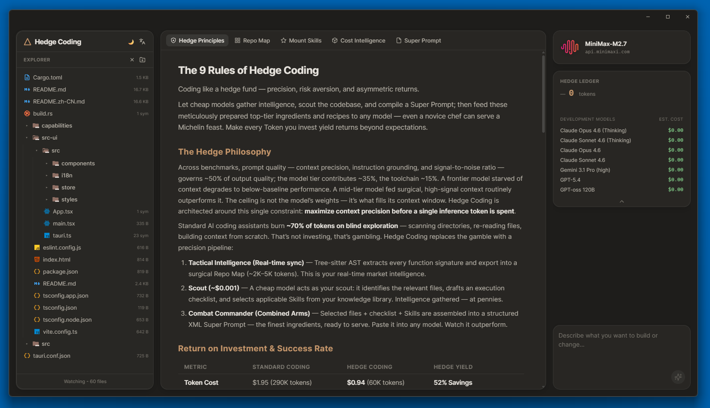
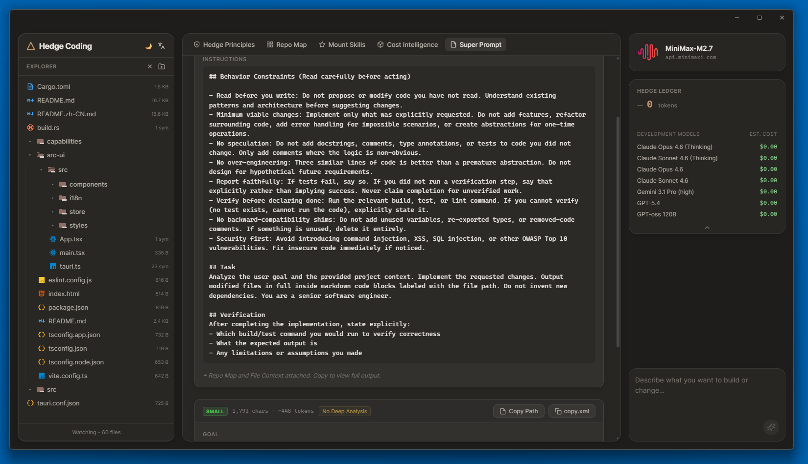
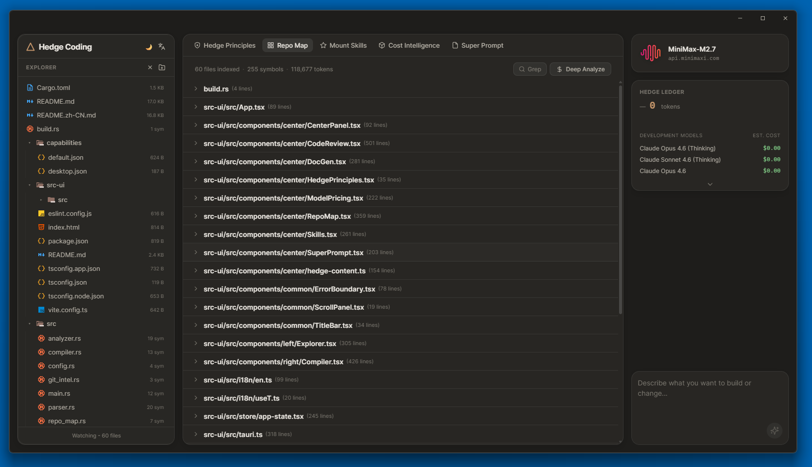

<p align="center">
  
</p>

<h1 align="center">Hedge Coding</h1>

<p align="center">
  <strong>AI 编程的超级提示词编译器。</strong><br/>
  读遍一切，不改一行。让任何模型都成为外科手术级工具。
</p>

<p align="center">
  <a href="./README.md">🇺🇸 English</a>
</p>

<p align="center">
  
  
  
  
  
</p>

<p align="center">
  <a href="#对冲哲学">对冲哲学</a> •
  <a href="#工作原理">工作原理</a> •
  <a href="#技术架构">技术架构</a> •
  <a href="#安装">安装</a> •
  <a href="#功能特性">功能特性</a> •
  <a href="#开发路线">开发路线</a>
</p>

---

## 为什么选择 Hedge Coding？

传统 AI 编程助手有 **~70% 的 Token 在盲目探索中烧掉** —— 扫描目录、反复读文件、从零构建上下文。这不是投资，这是赌博。

Hedge Coding 用一条**精准情报管道**取代赌博：廉价模型负责侦察，编译结构化 **Super Prompt**，然后交给你选择的任何模型执行。质量在提示词里，不在工具里。

> *让廉价模型收集情报、编译超级提示词；再把精心备好的顶尖食材和食谱投喂给任何模型 —— 哪怕是新手厨师，也能端出米其林盛宴。*

---

## 对冲哲学

基准测试表明，**提示词质量** —— 上下文精度、指令接地、信噪比 —— 决定约 **50%** 的输出质量。模型层级贡献约 35%，工具链仅占 15%。

一个顶尖 frontier model，一旦失去高质量上下文，其表现会跌破基准线；而一个中等模型，在外科手术级的高信号上下文加持下，可以持续超越前者。**天花板不是模型权重 —— 是你往 context window 里装了什么。**

Hedge Coding 围绕这一约束构建：**在消耗任何一枚推理 Token 之前，先将上下文精度最大化**。

### 三阶段管道

| 阶段 | 角色 | 执行内容 | 成本 |
|------|------|---------|------|
| **① 战术情报** | 实时同步 | Tree-sitter AST 提取每一个函数签名，生成精准 Repo Map（~2K–5K tokens） | 免费 |
| **② 侦察兵** | 预算模型 | 分类任务复杂度、选择相关文件、过滤 Skills、精炼目标 | ~$0.001 |
| **③ 作战指挥官** | XML 组装器 | 筛选文件 + 执行计划 + Skills → 结构化 Super Prompt | 免费 |

**将 Super Prompt 粘贴到任何 AI 工具中。让任何模型都成为外科手术级工具。**

### 投资回报率

| 维度 | 传统 AI 编程 | 对冲编程 | 对冲收益 |
|------|-------------|---------|---------|
| **Token 消耗** | $1.95（290K tokens） | **$0.94**（60K tokens） | **立省 52%** |
| **首发成功率** | ~40% 频繁幻觉 | **~85%** 精准指引 | **出活率翻倍** |
| **上下文浪费** | 重复阅读无关文件 | **零浪费**按需打包 | **算力全用于推理** |
| **订阅限额** | 配额 **3~7 天**耗尽 | **多撑 2 倍**开发量 | **每月多 10 天满血** |

> 管道单次成本约 $0.002。但真正的超额回报绝不仅是省钱 —— 而是 **"一发入魂" 的极高首发成功率**。

<p align="center">
  
</p>

---

## 工作原理

### Super Prompt 编译流程

```
输入你的任务目标（Goal）
        │
        ▼
┌─────────────────────────────────────────────────────────────────┐
│                    HEDGE CODING 引擎（Rust）                     │
│                                                                 │
│  ① 扫描 ──→ 文件系统遍历 + .gitignore 过滤                       │
│  ② 解析 ──→ Tree-sitter AST：函数、类、导出                       │
│  ③ 缓存 ──→ 加载深度分析语义摘要                                   │
│  ④ 侦察 ──→ 预算模型分类任务 + 智能选择文件                         │
│  ⑤ 情报 ──→ Git diff 变更检测（中等/复杂任务）                      │
│  ⑥ 技能 ──→ 过滤并注入相关技能全文                                  │
│  ⑦ 编译 ──→ 组装 8 层 XML Super Prompt                           │
│  ⑧ 存档 ──→ 持久化至 .hedgecoding/tasks/ 并记录元数据               │
│                                                                 │
└───────────────────────────┬─────────────────────────────────────┘
                            │
                            ▼
                   Super Prompt（XML）
                            │
                            ▼
              复制 → 粘贴到任意 AI 工具
         Claude Code / Cursor / ChatGPT / Windsurf / API
```

### 分层情报架构

Super Prompt 不是一个扁平的上下文堆砌，而是一份**分层情报档案** —— 每一层服务于特定的认知目的：

```xml
<project_memory>        <!-- 第 0 层：项目规则（MEMORY.md） -->
<user_goal>             <!-- 第 1 层：精炼目标（预算模型生成） -->
<repo_map>              <!-- 第 2 层：AST 文件 + 符号地图 -->
<file_intelligence>     <!-- 第 3 层：语义摘要（深度分析） -->
<skills_context>        <!-- 第 4 层：过滤后的项目技能 -->
<target_files>          <!-- 第 5 层：智能选择的完整源代码 -->
<battlefield_changes>   <!-- 第 6 层：Git 工作区 diff -->
<execution_instructions><!-- 第 7 层：针对性执行指导 -->
```

### 自适应任务分级

预算模型对每个任务进行分类，并**相应调整提示词内容**：

| 任务规模 | 包含文件 | Git Diff | 文件情报 | 典型 Token 量 |
|---------|---------|----------|---------|-------------|
| **轻量任务** | 1–5 个（精准） | ✗ 跳过 | ✗ 跳过 | ~5K–15K |
| **中等任务** | 5–15 个（定向） | ✓ 注入 | ✓ 注入 | ~15K–45K |
| **复杂任务** | 15+ 个（全面） | ✓ 注入 | ✓ 注入 | ~30K–80K |

> 轻量任务刻意裁剪上下文。少即是多 —— 简单修复不需要无关噪音。

<p align="center">
  
</p>

---

## 技术架构

```
┌──────────────────────────────────────────────────────────────────────┐
│                          HEDGE CODING                                │
│                                                                      │
│  ┌─────────────────────┐              ┌────────────────────────┐     │
│  │   前端（React）      │   Tauri IPC  │   后端（Rust）          │     │
│  │                     │◄────────────►│                        │     │
│  │  Compiler.tsx       │              │  server.rs（IPC 枢纽）  │     │
│  │  SuperPrompt.tsx    │              │  scanner.rs            │     │
│  │  RepoMap.tsx        │              │  parser.rs（Tree-sitter）│    │
│  │  Skills.tsx         │              │  repo_map.rs           │     │
│  │  CodeReview.tsx     │              │  analyzer.rs（LLM API）│     │
│  │  DocGen.tsx         │              │  compiler.rs（XML）    │     │
│  │  app-state.tsx      │              │  git_intel.rs          │     │
│  │  tauri.ts（桥接）    │              │  watcher.rs（notify）  │     │
│  │                     │              │  token_counter.rs      │     │
│  └─────────────────────┘              └────────────────────────┘     │
│                                                                      │
│  技术栈：                                                             │
│  • Tauri v2        — 原生桌面外壳，~3MB 二进制                         │
│  • Tree-sitter     — JS/TS/Python/Rust AST 解析                      │
│  • tiktoken-rs     — 精确 Token 计数（GPT tokenizer）                 │
│  • git2（libgit2）  — 原生 Git diff，无需 shell                       │
│  • notify          — 实时文件系统监听                                   │
│  • reqwest         — 预算模型 HTTP API 调用                            │
└──────────────────────────────────────────────────────────────────────┘
```

### 编译管线 —— 逐步拆解

```
步骤 1   用户在编译器面板输入 Goal
         ↓
步骤 2   前端发起 IPC：compilePrompt(goal, files, skills, memory)
         ↓
步骤 3   Rust 重新扫描文件系统 + 重新解析 AST（始终最新）
         ↓
步骤 4   加载深度分析缓存（.hedgecoding/analysis_cache.json）
         ↓
步骤 5   ⭐ 预算模型：classify_and_refine()
         → 任务规模（轻量 / 中等 / 复杂）
         → 精炼目标（引用具体函数名）
         → 目标文件（智能选择，1-20 个文件）
         → 执行指导（2-4 条任务级注意事项）
         → 相关技能（从可用集合中过滤）
         ↓
步骤 6   Git diff 注入（仅中等/复杂任务）
         ↓
步骤 7   技能全文注入（经预算模型过滤）
         ↓
步骤 8   compiler.rs 组装 8 层 XML
         ↓
步骤 9   保存至 .hedgecoding/tasks/{project}_{timestamp}.md
         ↓
步骤 10  前端渲染气泡卡片 → 用户复制到剪贴板
```

### 优雅降级

每个组件都能优雅降级，单一故障不会中断整条管道：

| 条件 | 行为 |
|------|------|
| 未配置预算模型 | 跳过分类 → 使用全部文件 |
| 分类返回无效 JSON | 回退到全部文件 |
| 智能选择返回 0 个文件 | 回退到全部文件 |
| 无深度分析缓存 | 跳过 `<file_intelligence>` 层 |
| 无 Git 仓库 | 跳过 `<battlefield_changes>` 层 |
| 未配置 Skills | 跳过 `<skills_context>` 层 |
| 无 MEMORY.md | 跳过 `<project_memory>` 层 |

---

## 功能特性

### 🗺️ 代码地图（Tree-sitter AST）
多语言结构化解析 —— 提取每一个函数、类、结构体、接口、枚举和导出，生成紧凑的符号地图。支持 **JavaScript、TypeScript、Python、Rust**，其他语言通用回退。

<p align="center">
  
</p>

### 🔍 深度分析
预算模型为每个文件生成一行语义摘要。预计算并缓存 —— 编译时零成本。让接收模型无需读取单个文件即可全面理解代码库。

### 🎯 智能文件选择
预算模型读取你的目标 + 代码地图，**只选择真正相关的文件**。相比全量包含，Super Prompt 体积缩减 60–80%。

### 📋 技能挂载
将可复用的开发规范以 `.hedgecoding/skills/*.md` 文件形式挂载。每个技能带有 `when_to_use` 字段。预算模型按任务自动过滤 —— **零失真全量注入**到 Super Prompt。

### 🧠 项目记忆
`.hedgecoding/MEMORY.md` 中的持久规则被编译**进入**每一个 Super Prompt。你的项目规范随 Prompt 带入任何 AI 工具 —— Claude Code、Cursor、ChatGPT 或原始 API 调用。

### 📊 模型价格情报
实时显示 7 个顶尖模型的成本对比 —— Claude Opus 4.6、Sonnet 4.6、Gemini 3.1 Pro、GPT-5.4 等。让你在开发前就清楚每一枚 Token 的价格。

### 🔎 全文搜索
正则全文搜索整个代码库 —— 瞬间定位任意符号、模式或 TODO。零 Token 消耗。

### 🛡️ 代码审查
粘贴 `git diff` 编译安全聚焦的审查 Super Prompt。采用验证代理方法论：三阶段分析，严重度评分加对抗性探测。

### 📚 超级文档
全量源代码上下文投喂给任何模型，生成全面文档。支持 Docusaurus、VitePress、GitBook、MkDocs 和纯 Markdown。

### 👁️ 文件系统监听
通过 `notify` 库实时检测文件变更。自动失效过期的分析缓存，保持代码地图始终最新。

---

## 安装

### 一键极速安装（即将推出）
*首次发布 Release 后，你就可以不用配置环境甚至无需编译，直接一键安装到桌面。*

#### Windows
```powershell
irm https://raw.githubusercontent.com/edison7009/hedge-coding/main/install.ps1 | iex
```

#### macOS / Linux
```bash
curl -fsSL https://raw.githubusercontent.com/edison7009/hedge-coding/main/install.sh | bash
```

<details>
<summary><strong>从源码构建（适合开发者）</strong></summary>

**前置条件：** [Rust](https://rustup.rs/)（stable） + [Node.js](https://nodejs.org/)（v18+）

#### Windows
```powershell
git clone https://github.com/edison7009/hedge-coding.git
cd hedge-coding
cargo install tauri-cli --version "^2"
cd src-ui && npm install && npm run build && cd ..
cargo tauri build
# 安装包 → target\release\bundle\nsis\Hedge Coding_*.exe
```

#### macOS
```bash
git clone https://github.com/edison7009/hedge-coding.git
cd hedge-coding
cargo install tauri-cli --version "^2"
cd src-ui && npm install && npm run build && cd ..
cargo tauri build
# 应用 → target/release/bundle/dmg/Hedge Coding_*.dmg
```

#### Linux
```bash
sudo apt install libwebkit2gtk-4.1-dev libappindicator3-dev librsvg2-dev
git clone https://github.com/edison7009/hedge-coding.git
cd hedge-coding
cargo install tauri-cli --version "^2"
cd src-ui && npm install && npm run build && cd ..
cargo tauri build
# 安装包 → target/release/bundle/deb/hedge-coding_*.deb
```
</details>

安装后，从桌面启动 **Hedge Coding** —— 无需命令行。

### 配置预算模型

创建 `~/.HedgeCoding/models.json`：

```json
{
  "modelId": "deepseek-chat",
  "baseUrl": "https://api.deepseek.com/v1",
  "apiKey": "sk-your-key-here"
}
```

支持所有 OpenAI 兼容 API：DeepSeek、Minimax、本地 Ollama、vLLM 等。

---

## 对冲编程九条军规

> *像对冲基金一样编程 —— 精准、避险、非对称收益。*

| # | 军规 | 核心洞察 |
|---|------|---------|
| 一 | 巧用新会话 | 全新会话 + Super Prompt = 完整上下文，零预热 |
| 二 | 把任务路由到正确层级 | 不要用 $5/M token 的模型写模板代码 |
| 三 | 指令先给位置 | 文件路径 + 行号 > "帮我找那个 bug" |
| 四 | 不为读过的文件重复付费 | Super Prompt 一次编译，零重复探索 |
| 五 | 每次会话前过滤知识库 | 只有相关技能按任务注入 |
| 六 | Super Prompt 自带说明 | 项目规则随 Prompt 带入任何工具 |
| 七 | 先规划再写代码 | 验证方向后再生成生产代码 |
| 八 | 打磨你的任务描述 | 你的 Goal 是推理质量的精度上限 |
| 九 | 读遍一切，不改一行 | Hedge Coding 只读 —— 你始终掌握控制权 |

---

## 竞品对比

| 能力 | Claude Code | Cursor | Hedge Coding |
|-----|-------------|--------|-------------|
| 文件读取 | ✓ 运行时消耗 Token | ✓ 运行时 | ✓ **预编译，免费** |
| 代码库理解 | 每次会话重新学习 | 部分索引 | **持久化分层情报** |
| Token 效率 | ~70% 浪费在探索 | 类似 | **零浪费精准打包** |
| 工具无关性 | 仅限 Claude | 仅限 Cursor | **通用 —— 任何工具** |
| 成本可见性 | 隐藏 | 隐藏 | **模型价格情报面板** |
| Git 感知 | 部分 | 部分 | **Diff 注入提示词** |
| 智能文件选择 | 读取全部 | 基于 RAG | **预算模型预选** |
| 会话连续性 | 新会话丢失上下文 | 类似 | **Super Prompt 携带一切** |

---

## 开发路线

- [x] **Phase 1** — 核心引擎：扫描器、Tree-sitter 解析器、代码地图、XML 编译器、Token 计数器
- [x] **Phase 2** — 桌面应用：Tauri v2 原生外壳 + React UI
- [x] **Phase 3** — 预算模型集成：深度分析、智能文件选择、任务分类
- [x] **Phase 4** — 技能系统：零失真全量注入 + `when_to_use` 过滤
- [x] **Phase 5** — 项目记忆：MEMORY.md 编译进每个 Super Prompt
- [x] **Phase 6** — Git 情报：工作区 diff 注入 + 文件系统监听
- [x] **Phase 7** — 代码审查：安全聚焦的审查提示词编译器
- [x] **Phase 8** — 超级文档：多格式文档生成

---

## 开源协议

MIT

---

<p align="center">
  <strong>Hedge Coding —— AI 编程的军师。</strong><br/>
  读遍一切，不改一行。<br/>
  编译业界最精准的情报档案。<br/>
  粘贴到任何工具，让任何模型都成为外科手术级工具。
</p>
